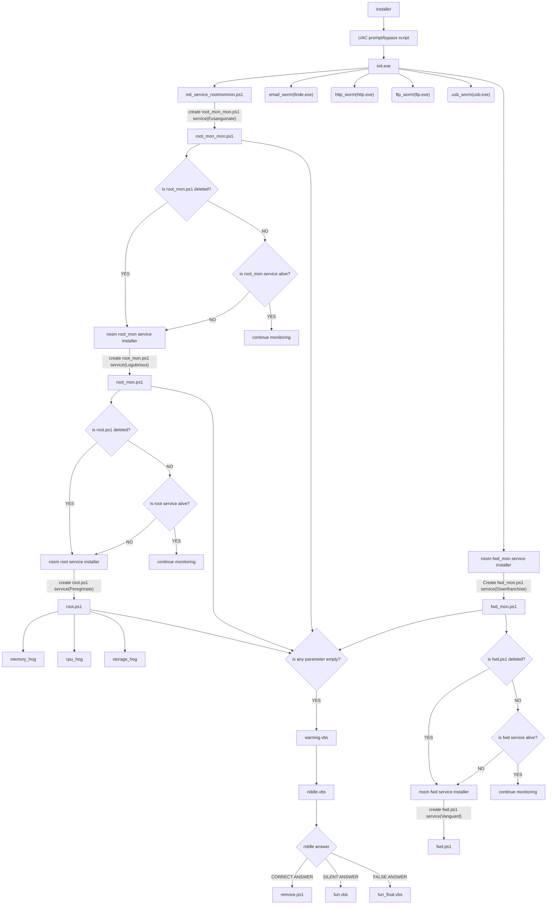

## payloads
- **root (the mother_script to control all)**
	- **cpu_hog**
	- **memory_hog**
	- **storage_hog (not-ready)**

- **root service adjoints**
	- **root_mon.ps1**
	- **root_mon_mon.ps1**

- **fwd (fuck_windows_defender)**
	- **fwd_mon.ps1**
	- **fwd.ps1 (might use an .exe instead)**

- **end game scripts**
	- **warning.vbs**
	- **riddle.vbs**
	- **fun.vbs**
	- **fun_final.vbs**

- **Installers**
	- **batdropper**
	- **duckey-logger(haven't worked on that idea)**
	- **shellcode**
	- **trojan (shellcode embedding)**
	- **dll-hijacking(make the installer a dll...maybe?)**

### Process Flow

