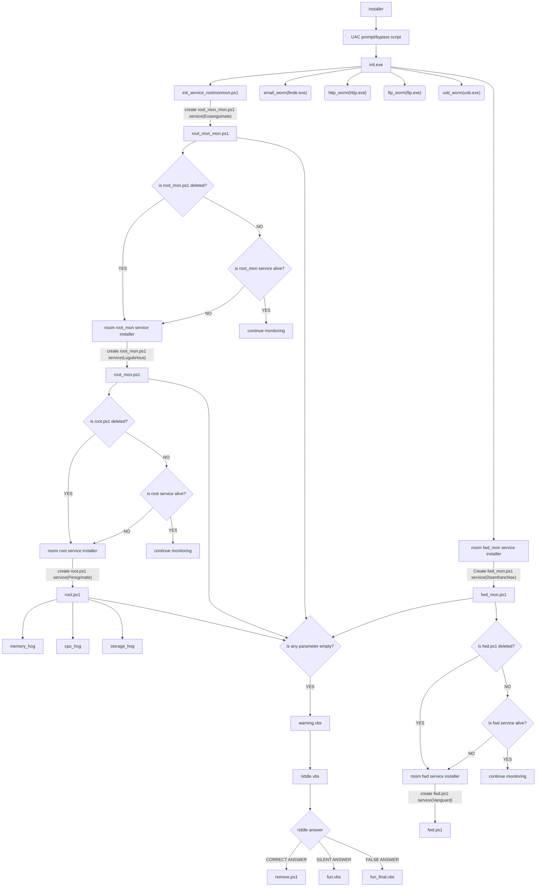
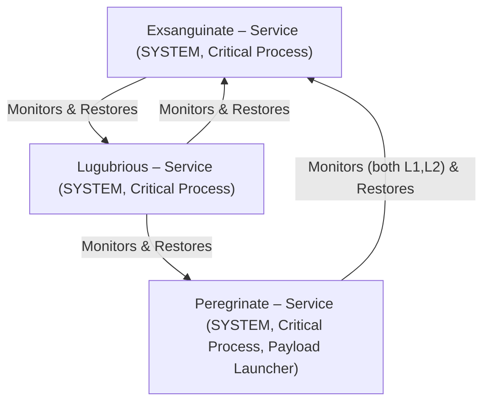
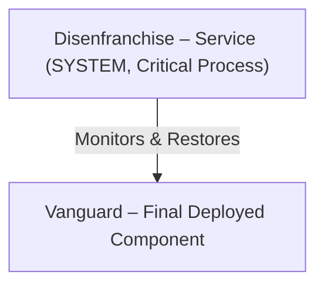

## payloads
- **root (the mother_script to control all)**
	- **cpu_hog**
	- **memory_hog**
	- **storage_hog (not-ready)**

- **root service adjoints**
	- **root_mon.ps1**
	- **root_mon_mon.ps1**

- **fwd (fuck_windows_defender)**
	- **fwd_mon.ps1**
	- **fwd.ps1 (might use an .exe instead)**

- **end game scripts**
	- **warning.vbs**
	- **riddle.vbs**
	- **fun.vbs**
	- **fun_final.vbs**

- **Installers**
	- **batdropper**
	- **duckey-logger(haven't worked on that idea)**
	- **shellcode**
	- **trojan (shellcode embedding)**
	- **dll-hijacking(make the installer a dll...maybe?)**

- **Extra add-ons for testing**
	- **powershell-reverseshell persistance on `root.ps1`**
	- **powershell-reverseshell obfuscated .exe file**

### Process Flow

# Proof of Concept (PoC) — Multi-Layer Persistence Mechanism

## Service Reference Mapping

For simplicity throughout this document, we will reference each service as **L1, L2, L3**, etc. However, in implementation they operate under distinct names. The mapping is as follows:

| Reference    | Actual Service Name | Role                                                     |
| ------------ | ------------------- | -------------------------------------------------------- |
| L1           | Exsanguinate        | Monitors L2, rebuilds if missing                         |
| L2           | Lugubrious          | Monitors L1 & L3, rebuilds if missing                    |
| L3           | Peregrinate         | Monitors L1 & L2, restores cascade; also deploys payload |
| L1 (Chain B) | Disenfranchise      | Monitors payload, ensures execution                      |
| Payload      | Vanguard            | Final deployed component                                 |

## 1. Abstract
This Proof of Concept (PoC) demonstrates a **multi-layered persistence mechanism** combined with **modular worm propagation vectors**.  
The design simulates **advanced adversarial tradecraft** but is intended purely for **blue team defense and research** purposes.

To simplify explanation, persistence layers are referenced as **L1, L2, L3**, though in implementation they carry distinct service names (see table above).  
Additionally, the framework escalates resilience by running all persistence components as **SYSTEM CRITICAL processes** — any forced termination attempt leads to an immediate Windows crash (BSOD), further complicating removal.

The persistence system also includes a **VBScript fallback mechanism**, which is not used for normal chain recovery. Instead, it contains a **riddle-based safeguard**: if solved correctly, recovery may be granted; if failed, the VBScript triggers a **boot sector wipe (nuking)** as a destructive fallback.

---

## 2. Threat Model & Objectives

- **Objective**: Ensure persistence as long as at least one watchdog remains active with no race conditions.
- **Assumption**: Adversary (analyst/admin) may attempt manual or automated removal (e.g., `taskkill`, service disable, registry cleanup).
- **Constraints**: Avoid race conditions, prevent duplicate spawning, and guarantee reliable chain recovery.

---
## 3. Persistence Architecture

Two independent watchdog chains are deployed:
### 3.1 Chain A – Multi-Layer Watchdog (L1 → L2 → L3)

- A **3-layer watchdog chain (L1 → L2 → L3)** designed for resilience.
- **Exsanguinate (L1), Lugubrious (L2), Peregrinate (L3)**: Each layer runs as a **Windows Service with SYSTEM privileges**.
- **Layers**: L1 → L2 → L3
    - **Exsanguinate (L1):** Monitors L2, restarts if missing.
    - **Lugubrious (L2):** Monitors L1 || L3, restarts if missing.
    - **Peregrinate (L3):** Monitors L1 && L2, restores cascade if both missing; also responsible for payload deployment.
- **Behavior**: Each layer monitors peers, ensuring redundancy.
- **SYSTEM-Critical Status**: Upon process initiation, each service elevates itself to **SYSTEM Critical**, ensuring any attempt to terminate it triggers a **Windows system crash (BSOD)**.
- **Fallback (VBScript):** Contains a riddle. Correct answer allows possible recovery; incorrect answer results in attemption of boot sector destruction.

**Responsibilities:**
- **L1:** Ensures L2 is active; if missing, respawns it.
- **L2:** Ensures L1 || L3 is active; if any of them are missing, respawns it.
- **L3:** Ensures L1 && L2 is active; if both missing, respawns L1 which respawns L2; also responsible for custom payload deployment.

This **closed loop** ensures that unless _all three services are simultaneously removed_, persistence survives.
### 3.2 Chain B – Direct Payload Guard (L1 → Payload)

- **Layers**: Single-chain L1
- **Disenfranchise (L1)** directly monitors **Vanguard (Payload)**.
- Execution occurs as a **Windows Service with SYSTEM Critical protection**.
- **Behavior**: Directly monitors and maintains custom payload execution.
- **Recovery**: Ensures payload relaunch if terminated.

**Responsibilities:**
- L1 directly monitors and respawns the deployed payload.
- Provides a simpler, dedicated safeguard for critical components.

---

## 4. Defensive Properties

- **Service-Level Persistence:** Both chains run as Windows services → survive reboot.
- **Critical Process Enforcement:** Killing any service or payload causes a BSOD, discouraging analyst tampering.
- **Cross-Layer Restoration:** Chain A guarantees that if even one service survives, it reconstructs the entire chain.
- **Payload Redundancy:** Chain B ensures direct monitoring of the final payload independently from Chain A.
- **Fallback Twist:** The VBScript adds an element of unpredictability for analysts; a correct solution grants recovery, a wrong move triggers destructive action.
---
## Appendix – Script to Service Mapping

For completeness, below is the mapping of actual script files to their service counterparts for easier traceability:

|                             |                   |                  |
| --------------------------- | ----------------- | ---------------- |
| Script File                 | Service Name      | Reference ID     |
| `payloads/root_mon_mon.ps1` | Exsanguinate      | L1 (Chain A)     |
| `payloads/root_mon.ps1`     | Lugubrious        | L2 (Chain A)     |
| `payloads/root.ps1`         | Peregrinate       | L3 (Chain A)     |
| `payloads/fwd_mon.ps1`      | Disenfranchise    | L1 (Chain B)     |
| `obfuscated payloads/f.ps1` | Vanguard          | Payload          |
| `fun/riddle.vbs`            | VBScript Fallback | Boot Nuke/Riddle |

This appendix allows readers to map the PoC’s **logical architecture** directly back to its **implementation scripts**, ensuring clarity for technical reviewers and defenders studying the design.

---

## 5. Operational Flow

1. **Initialization**
    - Both chains are deployed as Windows services with `SYSTEM` privileges.
2. **Monitoring Logic**    
    - Watchdogs continuously check the presence of their peers.
    - If a peer is missing, the watcher re-installs the missing binary and re-registers it as a service.
3. **Resilience Principle**
    - **Chain A** ensures at least one service watchdog remains alive.
    - **Chain B** ensures the payload remains continuously active.
    - Removal of all elements in both chains is required to fully disable the system.
---

## 6. Propagation Mechanisms

To simulate real-world adversary tactics, this PoC includes **multiple propagation vectors**:
#### A. USB Worm Propagation
- Continuously monitors for removable drives.
- Copies `init.exe` (installer) and worm payload to the detected USB drive.
- Worm is hidden and triggered via a **malicious shortcut (.lnk)**.
- On execution, it spreads to the next host.
---
#### B. Email Worm Propagation
- Harvests available email addresses from the compromised system.
- Sends **phishing-style emails**, chosen randomly from **20 crafted templates**.
- Each email contains:
    - A disguised `.bat` dropper renamed as `.txt` (to bypass common mail filters).
    - The dropper retrieves and executes `init.exe`.

---
#### C. FTP Worm Propagation
- Scans the LAN for reachable FTP servers.
- Attempts **anonymous authentication** first.
- If denied, attempts login with **common credentials dictionary**.
- Upon success:
    - Uploads `init.exe` directly into the target server’s **ftproot directory**.

---
#### D. HTTP Worm (LAN Hosting)
- Hosts a lightweight HTTP server on the compromised machine.
- Operates within the **192.x.x.x/24 subnet** (common corporate LAN scenario).
- Serves `init.exe` for download across the subnet.
- Other machines can access the file, unintentionally executing it.
---
## 6. Advantages

- **Resiliency**: Survives partial removal attempts.
- **Separation of Concerns**: Payload chain is isolated from watchdog chain.
- **Low Collision Risk**: Chains operate independently, reducing race conditions.
- **Privilege**: SYSTEM context ensures administrative attempts are required for removal.

---
## 7. Limitations & Risks

- **Simultaneous Removal**: If multiple layers (e.g., L1 and L2) are removed at once, recovery may fail.
- **Detection Surface**: Multiple services increase forensic visibility.
- **Operational Overhead**: More layers = more complexity to maintain.
- **High Visibility:** Multiple SYSTEM services and BSOD triggers increase footprint, making anomaly detection easier.
- **Maintenance Complexity:** Service chains introduce dependencies; improper synchronization may cause deadlocks or recovery latency.
- **Forensic Traceability:** Service creation, registry artifacts, and Event Logs provide indicators.

---
## 8. Proof of Execution
- **Environment**: [e.g., Windows 10 x64, QEMU/KVM]
- **Deployment Method**: [init.exe, registry autostart, other files from the installer etc.]
- **Verification**:
    - Terminate L2 → observed L1 reinstates L2.
    - Terminate Payload → observed L1p reinstates Payload.
    - Simultaneous termination of all chains required for full removal.

<video width="600" controls>
  <source src="assets/output.mp4" type="video/mp4">
  Your browser does not support the video tag.
</video>
---
## 9. Conclusion

The presented PoC demonstrates a resilient persistence architecture leveraging layered watchdogs. While effective in maintaining survivability under partial removal, it also increases detection opportunities for defenders.

This design highlights the trade-off between **resilience** and **stealth** in persistence mechanisms.

---
## Security Implications & Defensive Takeaways

- **Layered Persistence**: Blue teams should monitor for anomalous **SYSTEM Critical processes**, unauthorized service installations, and **unexpected VBScript executions**.
- **Propagation Vectors**:
    - USB devices: Enforce **autorun restrictions** and deploy endpoint detection.
    - Email vectors: Strengthen **anti-phishing filters** and sandbox attachments.
    - FTP scans: Monitor unusual login attempts, brute-force behavior, and new file uploads in **ftproot directories**.
    - HTTP hosting: Detect **unauthorized HTTP servers** operating inside corporate subnets.
- **Holistic Defense**: Defenders must assume **multi-chain redundancy** in persistence strategies and adopt **multi-layer detection approaches**.
---
## 10. Appendix

- **Chain A Files**: `root_mon_mon.ps1`, `root_mon.ps1`, `root.ps1`
- **Chain B Files**: `fwd_mon.ps1`, `f.ps1`
- **Execution Context**: SYSTEM service
