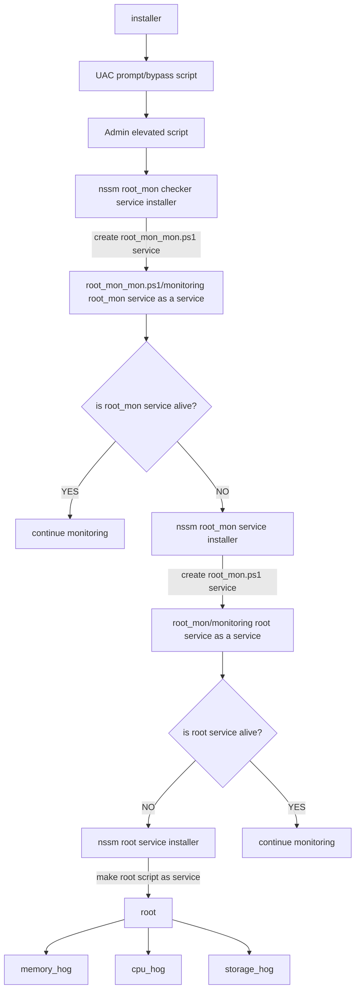

# progressive_0verload

### payloads
- **root (the mother_script to control all)**
	- **cpu_hog**
	- **memory_hog**
	- **storage_hog (not-ready)**

- **Installers**
	- **batdropper**
	- **duckey-logger(haven't worked on that idea)**
	- **shellcode**
	- **trojan (shellcode embedding)**
	- **dll-hijacking(make the installer a dll...maybe?)**

### Execution Flow

